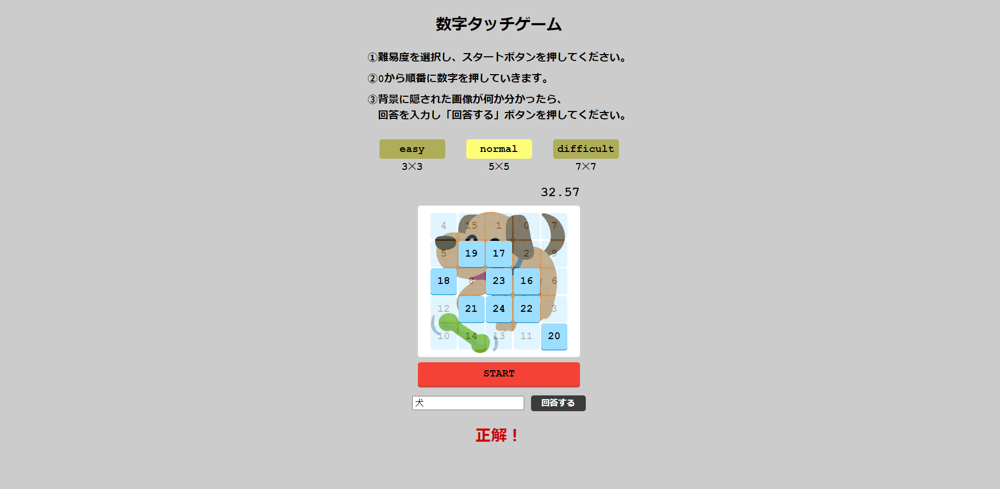

## Webアプリ名
「NumberGame」

## URL
https://matsuda1017.github.io/NumberGame

## 遊び方
➀難易度を選択し、スタートボタンを押してください。
➁0から順番に数字を押していきます。
➂背景に隠された画像が何か分かったら、
　回答を入力し「回答する」ボタンを押してください。
 
## 使用言語
・HTML
・CSS
・JavaScript

## 機能、意識した点
・表示される数字、画像をランダムにした点
・タイマーの管理
・ボタンの活性、非活性
・難易度に応じ、数字の数や全体の大きさを変化させる点

## サンプル画像

